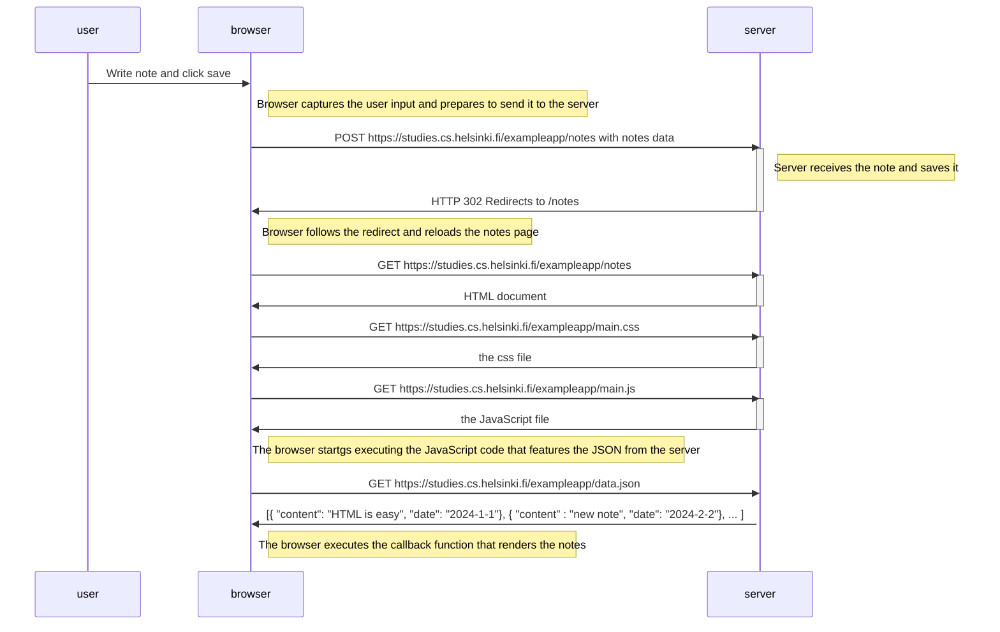

```mermaid
sequenceDiagram
    participant user
    participant browser
    participant server

    user->>browser: Write note and click save
    Note right of browser: Browser captures the user input and prepares to send it to the server

    browser->>server: POST https://studies.cs.helsinki.fi/exampleapp/notes with notes data
    activate server
    Note right of server: Server receives the note and saves it
    server->>browser: HTTP 302 Redirects to /notes
    deactivate server

    Note right of browser: Browser follows the redirect and reloads the notes page

    browser->>server: GET https://studies.cs.helsinki.fi/exampleapp/notes
    activate server
    server->>browser: HTML document
    deactivate server

    browser->>server: GET https://studies.cs.helsinki.fi/exampleapp/main.css
    activate server
    server->>browser: the css file
    deactivate server

    browser->>server: GET https://studies.cs.helsinki.fi/exampleapp/main.js
    activate server
    server->>browser: the JavaScript file
    deactivate server

    Note right of browser: The browser startgs executing the JavaScript code that features the JSON from the server

    browser->>server: GET https://studies.cs.helsinki.fi/exampleapp/data.json
    activate server
    server->>browser: [{ "content": "HTML is easy", "date": "2024-1-1"}, { "content" : "new note", "date": "2024-2-2"}, ... ]

    Note right of browser: The browser executes the callback function that renders the notes
```
