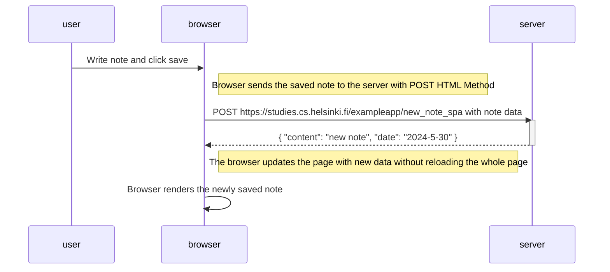

```mermaid
sequenceDiagram
    participant user
    participant browser
    participant server

    user->>browser: Write note and click save

    Note right of browser: Browser sends the saved note to the server with POST  HTML Method

    browser->>server: POST https://studies.cs.helsinki.fi/exampleapp/new_note_spa with note data
    activate server
    server-->>browser: { "content": "new note", "date": "2024-5-30" }
    deactivate server

    Note right of browser: The browser updates the page with new data without reloading the whole page

    browser->>browser: Browser renders the newly saved note

```
